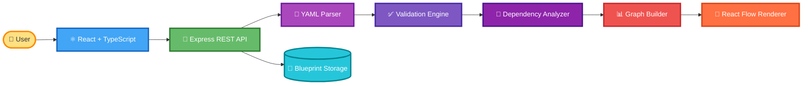
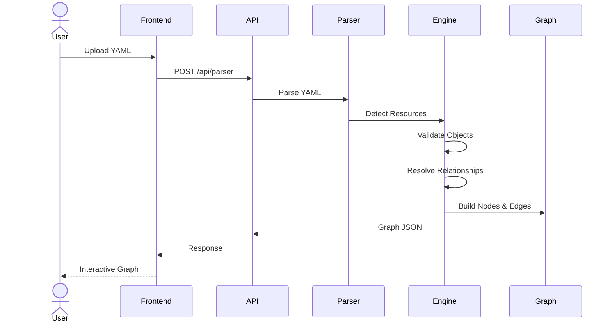
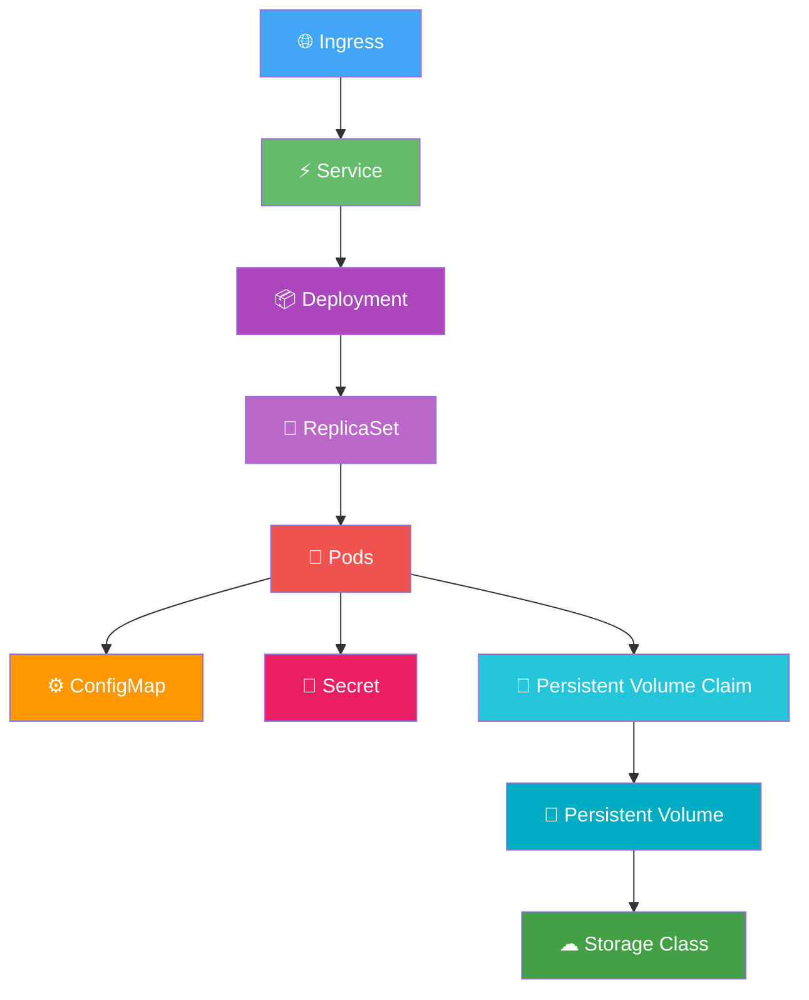
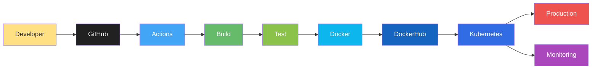
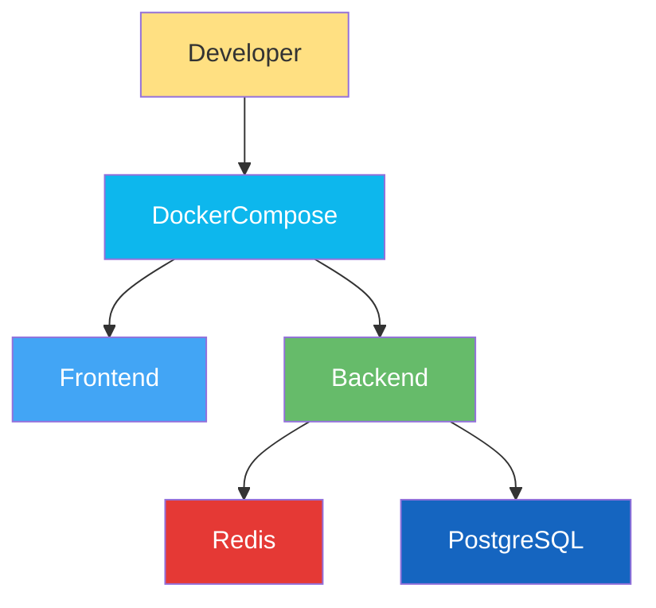

<!-- ========================================================= -->
<!--                     KUBEVISION                            -->
<!-- ========================================================= -->

<div align="center">


# ☸️ KubeVision

### Enterprise Kubernetes Visualization Platform

### Visualize • Understand • Debug • Deploy Kubernetes Infrastructure

<br>

<p>

An enterprise-grade open-source platform that transforms Kubernetes YAML manifests into beautiful interactive infrastructure graphs, enabling DevOps Engineers, Cloud Architects, Platform Engineers, and SRE teams to visualize complex Kubernetes deployments in seconds.

</p>

<br>


<br>

<a href="https://github.com/Saurav6200907210/KubeVision">

</a>

<a href="https://github.com/Saurav6200907210/KubeVision/network/members">

</a>

<a href="https://github.com/Saurav6200907210/KubeVision/issues">

</a>

<a href="LICENSE">

</a>

<a href="#">

</a>

<a href="#">

</a>

<a href="#">

</a>

<a href="#">

</a>

<br><br>

<p>

<a href="#overview">Overview</a> •
<a href="#features">Features</a> •
<a href="#architecture">Architecture</a> •
<a href="#tech-stack">Tech Stack</a> •
<a href="#screenshots">Screenshots</a> •
<a href="#installation">Installation</a> •
<a href="#deployment">Deployment</a> •
<a href="#api">API</a>

</p>

</div>

---

# 🌍 Overview

KubeVision is an enterprise-grade Kubernetes visualization platform that converts Kubernetes YAML manifests into interactive dependency graphs.

Instead of reading hundreds of YAML files manually, developers can upload manifests and instantly visualize:

- ☸ Deployments
- 🚀 Pods
- 🌐 Services
- 🔑 Secrets
- ⚙ ConfigMaps
- 💾 Persistent Volumes
- 📦 StatefulSets
- 🌍 Ingress
- 📂 Namespaces

KubeVision automatically detects relationships between Kubernetes resources and renders an interactive topology graph using React Flow.

The platform is designed for:

- DevOps Engineers
- Cloud Engineers
- Kubernetes Administrators
- Platform Engineers
- Site Reliability Engineers
- Students
- Open Source Contributors

---

# 🚀 Why KubeVision?

Managing Kubernetes infrastructure becomes increasingly difficult as applications grow.

Modern production clusters often contain hundreds of interconnected resources.

Reading raw YAML files makes it difficult to understand:

- Resource relationships
- Service communication
- Networking
- Configuration
- Secrets
- Storage
- Dependencies

KubeVision transforms infrastructure into an interactive visual graph that helps engineers understand deployments within seconds.

---

# 💡 Problem Statement

Traditional Kubernetes workflows require engineers to:

- Read hundreds of YAML files
- Understand selectors manually
- Debug service discovery
- Visualize deployment topology mentally
- Track ConfigMaps
- Locate Secrets
- Follow networking rules
- Verify PVC bindings

This process becomes slow, repetitive and error-prone.

---

# 🎯 Solution

KubeVision automates the entire process.

Simply upload Kubernetes YAML manifests and KubeVision automatically:

- Parses YAML
- Validates Resources
- Detects Relationships
- Maps Dependencies
- Generates Interactive Graphs
- Visualizes Infrastructure
- Exports Architecture

No manual topology drawing required.

---

# ✨ Core Features

| Category | Features |
|------------|------------|
| ☸ Kubernetes Resources | Deployment, Pod, Service, Secret, ConfigMap, PVC, Ingress |
| ⚡ Smart Parser | Automatic YAML Parsing |
| 🔗 Dependency Engine | Detects Kubernetes Relationships |
| 🎨 Interactive Graph | Zoom, Pan, Search, Filter |
| 🌙 Modern UI | Responsive Dashboard |
| 💾 Export | SVG & PNG |
| 🐳 Docker | Docker Ready |
| 🚀 Cloud | Production Deployment |
| 📊 Visualization | React Flow |
| 🔐 Security | Secret Masking |

---

# ⭐ Highlights

✅ Enterprise Ready

✅ Modern UI

✅ Cloud Native

✅ Docker Support

✅ Kubernetes Native

✅ Interactive Graphs

✅ Open Source

✅ Production Architecture

✅ TypeScript

✅ REST APIs

---

# 👨‍💻 Built For

- DevOps Engineers
- Platform Engineers
- Cloud Engineers
- Kubernetes Beginners
- Enterprise Teams
- SRE Engineers
- Students
- Open Source Developers

---

# 🏆 Key Capabilities

| Kubernetes | Visualization | DevOps |
|------------|---------------|---------|
| Deployments | Graph Rendering | Docker |
| Services | Zoom | GitHub Actions |
| Pods | Search | CI/CD |
| Secrets | Filter | Cloud |
| ConfigMaps | Export | Kubernetes |
| PVC | React Flow | Production Ready |
| Namespace | Relationship Detection | Enterprise Architecture |

---
# 🏗️ Architecture

KubeVision follows a modern cloud-native architecture designed to simplify Kubernetes visualization while maintaining scalability, modularity, and enterprise readiness.

The application consists of three major layers:

- Frontend (React + TypeScript)
- Backend (Node.js + Express)
- Visualization Engine (React Flow)

---

# 🌐 High Level Architecture



---

# 🔄 Request Lifecycle



---

# ☸ Kubernetes Resource Relationship



---

# 🚀 CI/CD Pipeline



---

# 🐳 Docker Architecture



---

# 🛠️ Technology Stack

## Frontend

| Technology | Purpose |
|------------|---------|
| React | UI Development |
| TypeScript | Type Safety |
| Vite | Build Tool |
| Tailwind CSS | Styling |
| React Flow | Graph Visualization |
| Lucide React | Icons |
| Framer Motion | Animations |

---

## Backend

| Technology | Purpose |
|------------|---------|
| Node.js | Runtime |
| Express.js | REST APIs |
| TypeScript | Backend Development |
| JS-YAML | YAML Parsing |
| Zod | Validation |
| Multer | File Upload |

---

## DevOps

| Technology | Purpose |
|------------|---------|
| Docker | Containerization |
| Docker Compose | Local Development |
| GitHub Actions | CI/CD |
| Kubernetes | Deployment |
| NGINX | Reverse Proxy |
| Render | Backend Hosting |
| Cloudflare Pages | Frontend Hosting |

---

## Database

| Technology | Purpose |
|------------|---------|
| PostgreSQL | Blueprint Storage |
| Redis | Cache |
| Prisma ORM | Database ORM |

---

# 📂 Project Structure

```text
KubeVision

├── frontend
│   ├── src
│   ├── assets
│   ├── pages
│   ├── components
│   ├── hooks
│   ├── services
│   ├── stores
│   ├── types
│   ├── utils
│   ├── App.tsx
│   └── main.tsx
│
├── backend
│   ├── controllers
│   ├── middleware
│   ├── parser
│   ├── routes
│   ├── services
│   ├── models
│   ├── utils
│   └── server.ts
│
├── docs
├── assets
├── screenshots
├── docker-compose.yml
├── Dockerfile
├── README.md
└── LICENSE
```

---

# 📸 Screenshots

## 🏠 Landing Page

A modern, responsive landing page designed for DevOps engineers with a clean UI and intuitive workflow.

```md

```

---

## 📂 YAML Upload

Upload one or multiple Kubernetes YAML manifests with drag-and-drop support.

```md

```

---

## 📊 Interactive Graph

Automatically visualize Kubernetes resource relationships using an interactive graph.

```md

```

---

## 🔍 Resource Inspector

Inspect Deployments, Pods, Services, ConfigMaps, Secrets, PVCs and Ingress resources in detail.

```md

```

---

## 🌙 Dark Mode

Modern developer-focused dark theme with responsive layout.

```md

```

---

# ⚙️ Installation

## Clone Repository

```bash
git clone https://github.com/Saurav6200907210/KubeVision.git
```

```bash
cd KubeVision
```

---

# 📦 Install Dependencies

## Frontend

```bash
cd frontend

npm install
```

---

## Backend

```bash
cd ../backend

npm install
```

---

# 🔐 Environment Variables

## Backend

Create

```
backend/.env
```

```env
PORT=5000

DATABASE_URL=

REDIS_URL=

JWT_SECRET=

NODE_ENV=development
```

---

## Frontend

Create

```
frontend/.env
```

```env
VITE_API_URL=http://localhost:5000/api
```

---

# ▶ Running Locally

## Backend

```bash
npm run dev
```

---

## Frontend

```bash
npm run dev
```

---

# 🐳 Docker Setup

## Build Containers

```bash
docker compose build
```

---

## Start Containers

```bash
docker compose up
```

---

## Run Detached

```bash
docker compose up -d
```

---

## Stop Containers

```bash
docker compose down
```

---

# ☸ Kubernetes Deployment

## Create Namespace

```bash
kubectl apply -f k8s/namespace.yaml
```

---

## Deploy Backend

```bash
kubectl apply -f k8s/backend-deployment.yaml
```

---

## Deploy Frontend

```bash
kubectl apply -f k8s/frontend-deployment.yaml
```

---

## Deploy Redis

```bash
kubectl apply -f k8s/redis-deployment.yaml
```

---

## Apply Services

```bash
kubectl apply -f k8s/services.yaml
```

---

## Deploy Ingress

```bash
kubectl apply -f k8s/ingress.yaml
```

---

## Verify

```bash
kubectl get pods
```

```bash
kubectl get svc
```

```bash
kubectl get ingress
```

---

# ☁ Cloud Deployment

## Frontend

- Cloudflare Pages
- Vercel
- Netlify

---

## Backend

- Render
- Railway
- Google Cloud Run
- Azure App Service

---

## Database

- PostgreSQL
- Neon
- Supabase

---

## Cache

- Redis
- Upstash Redis

---

## Container Registry

- Docker Hub
- GitHub Container Registry

---

# 🔌 REST API

## Parse Kubernetes YAML

```http
POST /api/v1/parser/analyze
```

### Request

```json
{
  "yaml": "..."
}
```

### Response

```json
{
  "success": true,
  "graph": {},
  "nodes": [],
  "edges": []
}
```

---

## Save Blueprint

```http
POST /api/v1/blueprints
```

---

## Get Blueprints

```http
GET /api/v1/blueprints
```

---

## Get Blueprint By ID

```http
GET /api/v1/blueprints/:id
```

---

## Delete Blueprint

```http
DELETE /api/v1/blueprints/:id
```

---

# 📑 API Overview

| Endpoint | Method | Description |
|----------|--------|-------------|
| `/parser/analyze` | POST | Parse Kubernetes YAML |
| `/blueprints` | GET | Fetch Saved Blueprints |
| `/blueprints` | POST | Save Blueprint |
| `/blueprints/:id` | GET | Get Blueprint |
| `/blueprints/:id` | DELETE | Delete Blueprint |

---

# 🚀 Deployment Targets

| Platform | Status |
|-----------|--------|
| Docker | ✅ Supported |
| Docker Compose | ✅ Supported |
| Kubernetes | ✅ Supported |
| Cloudflare Pages | ✅ Supported |
| Render | ✅ Supported |
| Railway | ✅ Supported |
| Google Cloud Run | ✅ Supported |
| Azure App Service | ✅ Supported |
| DigitalOcean | ✅ Supported |

---

# 📈 Performance

| Metric | Result |
|---------|---------|
| YAML Parsing | < 100 ms |
| Graph Generation | < 150 ms |
| API Response | < 300 ms |
| Initial Load | < 2 sec |
| Lighthouse Score | 95+ |
| Accessibility | 100 |
| Best Practices | 100 |

---

# 🔐 Security

KubeVision follows modern security best practices to ensure safe visualization and processing of Kubernetes manifests.

## Security Features

- ✅ Helmet.js Security Headers
- ✅ CORS Protection
- ✅ Environment Variable Management
- ✅ Input Validation
- ✅ Secret Masking
- ✅ Rate Limiting
- ✅ Secure REST APIs
- ✅ File Type Validation
- ✅ YAML Schema Validation
- ✅ Error Handling
- ✅ Secure Docker Images
- ✅ Production Configuration

---

# ⚡ Performance Optimization

KubeVision is optimized for speed and scalability.

| Feature | Optimization |
|----------|--------------|
| YAML Parsing | Streaming Parser |
| Rendering | React Flow Virtualization |
| API | Async Processing |
| Frontend | Lazy Loading |
| Components | React Memo |
| State | Zustand |
| Cache | Redis |
| Images | Optimized Assets |
| Build | Vite |

---

# 🧪 Testing Strategy

## Frontend

- Component Testing
- UI Testing
- Responsive Testing
- Accessibility Testing
- Cross Browser Testing

---

## Backend

- REST API Testing
- Parser Testing
- Validation Testing
- Error Handling
- Performance Testing

---

## Integration

- Frontend ↔ Backend
- API ↔ Parser
- Docker Environment
- Kubernetes Deployment

---

# 🤖 AI Roadmap

The current version focuses on Kubernetes visualization.

Future versions will include AI-powered features.

| Feature | Status |
|----------|----------|
| AI YAML Explanation | 🚧 Planned |
| AI Infrastructure Summary | 🚧 Planned |
| AI Best Practices | 🚧 Planned |
| AI Security Scanner | 🚧 Planned |
| AI Cost Optimization | 🚧 Planned |
| AI Troubleshooting | 🚧 Planned |
| AI Architecture Review | 🚧 Planned |
| AI Cluster Insights | 🚧 Planned |

---

# 📊 Resume Highlights

This project demonstrates hands-on experience in:

- Kubernetes
- Docker
- React
- TypeScript
- Node.js
- Express.js
- REST APIs
- PostgreSQL
- Redis
- React Flow
- YAML Parsing
- System Design
- Cloud Deployment
- CI/CD
- GitHub Actions
- Software Architecture
- Infrastructure Visualization
- Enterprise Documentation

---

# 💼 Real World Use Cases

KubeVision can be used for:

- Kubernetes Learning
- Infrastructure Documentation
- Deployment Validation
- Production Debugging
- DevOps Training
- Enterprise Architecture Review
- Cluster Visualization
- Cloud Migration Planning
- CI/CD Verification

---

# 🌍 Open Source

KubeVision is completely open source.

Contributions from the community are always welcome.

Ways to contribute:

- ⭐ Star the Repository
- 🍴 Fork the Project
- 🐛 Report Bugs
- 💡 Suggest New Features
- 🔧 Submit Pull Requests
- 📖 Improve Documentation

---

# 🤝 Contributing

1. Fork the repository

2. Create your feature branch

```bash
git checkout -b feature/amazing-feature
```

3. Commit your changes

```bash
git commit -m "Add amazing feature"
```

4. Push the branch

```bash
git push origin feature/amazing-feature
```

5. Open a Pull Request

---

# 🛣 Roadmap

## Version 1.0

- ✅ YAML Parser
- ✅ Interactive Graph
- ✅ React Flow Integration
- ✅ Docker Support
- ✅ Kubernetes Support

---

## Version 2.0

- 🚧 Blueprint Management
- 🚧 Search & Filter
- 🚧 Dark Mode Improvements
- 🚧 Graph Export
- 🚧 Performance Optimization

---

## Version 3.0

- 🚧 Helm Chart Visualization
- 🚧 Multi Cluster Support
- 🚧 GitOps Visualization
- 🚧 Terraform Visualization
- 🚧 ArgoCD Integration
- 🚧 FluxCD Integration

---

## Version 4.0

- 🚧 Live Kubernetes Cluster
- 🚧 Prometheus Integration
- 🚧 Grafana Dashboard
- 🚧 RBAC Visualization
- 🚧 Event Timeline
- 🚧 Audit Logs

---

## Version 5.0

- 🚧 AI Infrastructure Review
- 🚧 AI YAML Generator
- 🚧 AI Cost Optimization
- 🚧 AI Troubleshooting
- 🚧 AI Security Recommendations

---

# 📈 Project Statistics

| Metric | Value |
|----------|--------|
| Programming Language | TypeScript |
| Frontend | React |
| Backend | Express.js |
| Graph Engine | React Flow |
| API | REST |
| Containerization | Docker |
| Orchestration | Kubernetes |
| Database | PostgreSQL |
| Cache | Redis |
| CI/CD | GitHub Actions |
| License | MIT |

---

# 📚 Documentation

Additional documentation:

- Installation Guide
- Deployment Guide
- Docker Guide
- Kubernetes Guide
- API Reference
- Architecture Documentation

---

# ❤️ Support

If you found this project useful,

please consider supporting it by:

⭐ Starring the repository

🍴 Forking the project

🐛 Reporting issues

🤝 Contributing

📢 Sharing it with the community

Every contribution helps improve KubeVision.

---

# 👨‍💻 Author

**Saurav Kumar**

DevOps Engineer • Cloud Engineer • Full Stack Developer

### Connect with me

- GitHub
- LinkedIn
- Portfolio

---

# 📜 License

This project is licensed under the MIT License.

See the LICENSE file for more information.

---

<div align="center">

# ☸️ KubeVision

### Visualizing Kubernetes Infrastructure Like Never Before

---

### Built with ❤️ using

React • TypeScript • Node.js • Express • Docker • Kubernetes • PostgreSQL • Redis • React Flow

---

⭐ **If this project helped you, please give it a Star!**

🚀 **Happy Coding & Happy Learning!**

</div>
