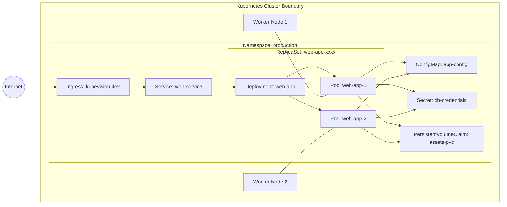
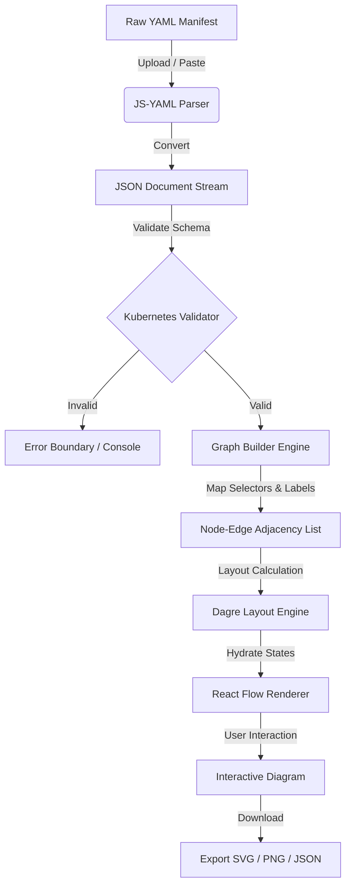
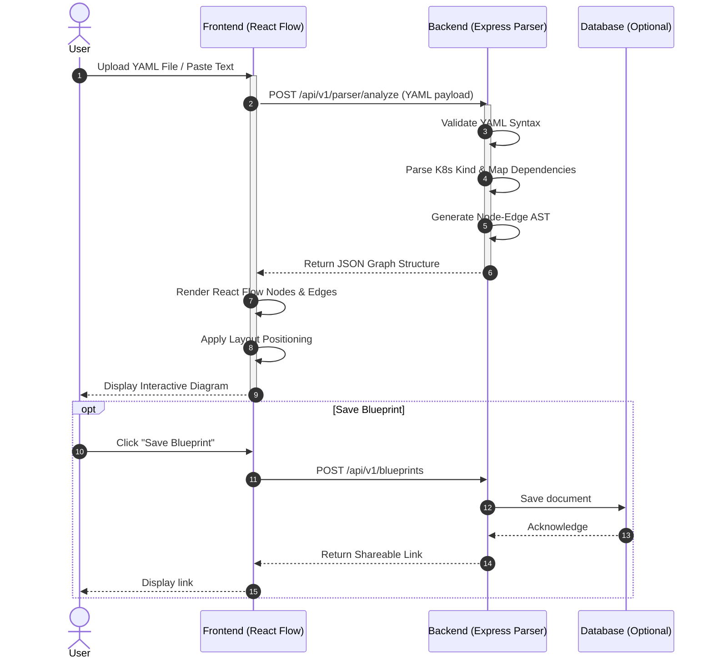
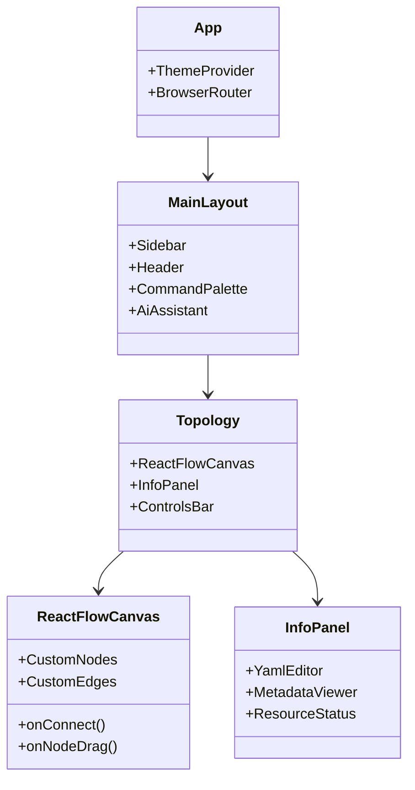
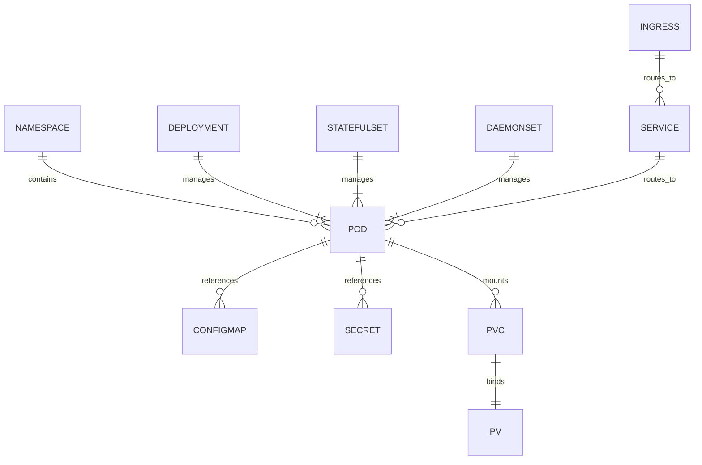
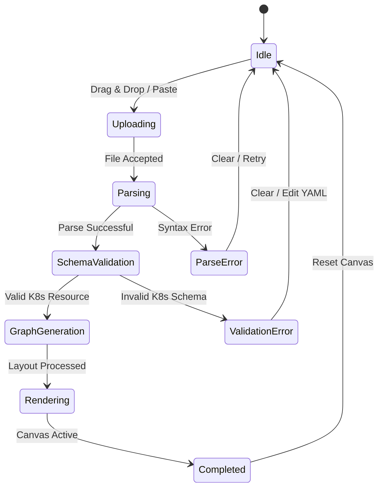
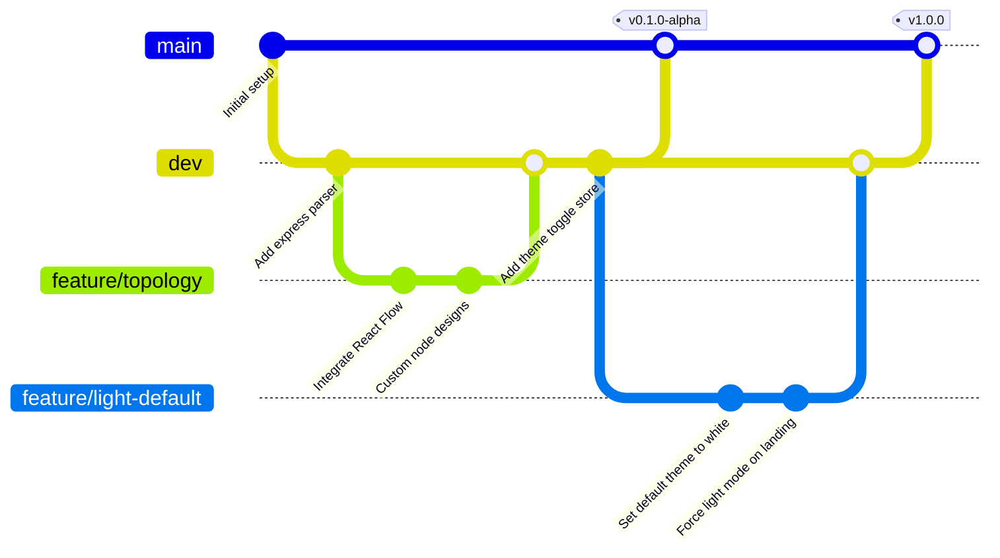
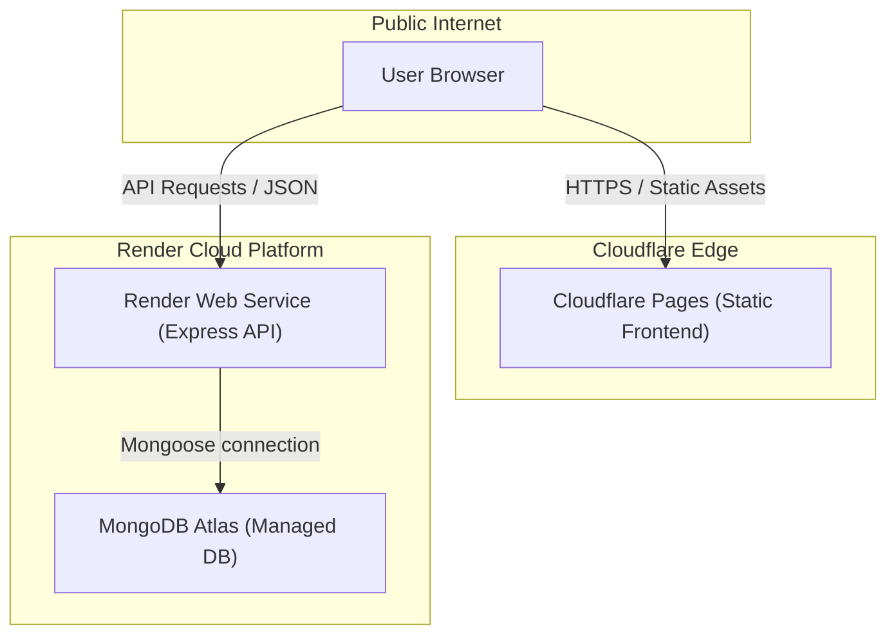

# KubeVision

<div align="center">


[](https://github.com/Saurav6200907210/KubeVision/stargazers)
[](https://github.com/Saurav6200907210/KubeVision/network/members)
[](https://github.com/Saurav6200907210/KubeVision/issues)
[](https://github.com/Saurav6200907210/KubeVision/pulls)
[](LICENSE)

<br />

[](#)
[](#)
[](#)
[](#)
[](#)
[](#)
[](#)
[](#)
[](#)
[](#)

<br />

### Visualizing the Invisible: From YAML Manifests to Real-time Cluster Topology

---


</div>

---

## 📖 Table of Contents

1. [Introduction](#-introduction)
2. [Why KubeVision?](#-why-kubevision)
3. [Features](#-features)
4. [Tech Stack](#-tech-stack)
5. [Architecture & Flow](#-architecture--flow)
   - [Interactive Architecture Diagram](#interactive-architecture-diagram)
   - [ASCII Architecture](#ascii-architecture)
   - [Workflow Diagram](#workflow-diagram)
   - [Project Workflow Sequence](#project-workflow-sequence)
   - [Component Relationship](#component-relationship)
   - [Kubernetes Object Relationship](#kubernetes-object-relationship)
   - [State Machine (Parser)](#state-machine-parser)
   - [Git Graph Workflow](#git-graph-workflow)
   - [User Journey](#user-journey)
   - [Deployment Architecture](#deployment-architecture)
   - [CI/CD Pipeline](#cicd-pipeline)
6. [Architecture Explanation](#%EF%B8%8F-architecture-explanation)
7. [Screenshots](#-screenshots)
8. [Folder Structure](#-folder-structure)
9. [Installation & Setup](#-installation--setup)
   - [Environment Variables](#environment-variables)
   - [Docker Setup](#docker-setup)
   - [Local Development](#local-development)
10. [Production Deployment](#-production-deployment)
11. [API Documentation](#-api-documentation)
12. [Project Highlights & Performance](#-project-highlights--performance)
13. [Future Roadmap](#-future-roadmap)
14. [Security & Scaling](#-security--scaling)
15. [Contribution Guide](#-contribution-guide)
16. [License](#-license)
17. [Support & Contact](#-support--contact)

---

## 🌟 Introduction

**KubeVision** is an enterprise-grade, open-source Kubernetes visualization platform designed to bridge the gap between static YAML manifests and dynamic mental models. By parsing multi-document Kubernetes manifests or connecting directly to active clusters, KubeVision renders an interactive, real-time node topology graph showing namespaces, nodes, workloads, networking, and configuration secrets in a single unified canvas.

> [!NOTE]
> Designed for DevOps engineers, SREs, and developers, KubeVision simplifies cluster debugging, resource relationship mapping, and architectural validation.

---

## ❓ Why KubeVision?

* **Cognitive Overload**: A typical production cluster has hundreds of resource manifests. Reading raw YAML files to map ingress routes to services, deployments, pods, and configmaps is error-prone and time-consuming.
* **Misconfigurations**: Lack of relationship visibility leads to orphaned services, incorrect selector matches, and unmounted volume claims.
* **Onboarding & Documentation**: Onboarding new engineers to complex microservice topologies takes weeks. KubeVision generates instant, interactive documentation.
* **On-the-Fly Validation**: Validate your YAML manifests locally before pushing them to your GitOps pipelines.

---

## ⚡ Features

| Feature | Description | Icon |
| :--- | :--- | :---: |
| **Interactive Canvas** | Zoom, pan, drag-and-drop, and expand/collapse nested Kubernetes resources. | 🎨 |
| **Multi-Source Input** | Drag-and-drop YAML, paste raw manifests, or connect via Kubeconfig. | 📥 |
| **Comprehensive Parsing** | Supports Deployments, Pods, Services, Ingress, ConfigMaps, Secrets, PVCs, and more. | 🔍 |
| **Real-time Status** | Visual indicators for Pod health, Node capacity, and Service availability. | 🟢 |
| **Secret Masking** | Automatically redacts sensitive data in parsed Secrets and ConfigMaps. | 🔒 |
| **Export Options** | Export generated diagrams to high-definition SVG, PNG, or JSON blueprints. | 💾 |
| **Dual Theme Support** | Clean white light theme by default, with an optional sleek dark mode toggle. | 🌗 |

---

## 🛠️ Tech Stack

### Frontend
* **Core Framework**: React 18 with TypeScript
* **State Management**: Zustand (with LocalStorage persistence)
* **Styling**: TailwindCSS & Lucide Icons
* **Graph Engine**: React Flow (with custom nodes & edge routing)
* **Animations**: Framer Motion

### Backend
* **Runtime**: Node.js & Express
* **Language**: TypeScript
* **Parser**: JS-YAML & Kubernetes Client SDK

### Database & Cloud
* **Database**: MongoDB (Optional, for saving blueprints)
* **Hosting (Frontend)**: Cloudflare Pages
* **Hosting (Backend)**: Render
* **Containerization**: Docker & Docker Compose

---

## 📊 Architecture & Flow

### Interactive Architecture Diagram
This diagram shows the relationship mapping within KubeVision when rendering a typical Kubernetes namespace.



### ASCII Architecture
```text
+-----------------------------------------------------------------------------------+
|                                 KUBEVISION CANVAS                                 |
+-----------------------------------------------------------------------------------+
|                                                                                   |
|   [ YAML/Kubeconfig ] ---> ( Express Backend Parser )                             |
|                                     |                                             |
|                                     v (JSON AST Graph Data)                       |
|   +---------------------------------------------------------------------------+   |
|   |                       REACT FLOW TOPOLOGY ENGINE                          |   |
|   |                                                                           |   |
|   |   +------------------+     +-------------------+     +----------------+   |   |
|   |   |  Ingress Node    | --> |   Service Node    | --> |  Pod Node (1)  |   |   |
|   |   +------------------+     +-------------------+     +----------------+   |   |
|   |                                                      |                    |   |
|   |                                                      +-> [ ConfigMap ]    |   |
|   |                                                      |                    |   |
|   |                                                      +-> [ Secret ]       |   |
|   |                                                                           |   |
|   +---------------------------------------------------------------------------+   |
|                                                                                   |
+-----------------------------------------------------------------------------------+
```

### Workflow Diagram
This flowchart details how KubeVision processes incoming Kubernetes manifests.



### Project Workflow Sequence
This sequence diagram shows the step-by-step communication during manifest upload and visualization.



### Component Relationship


### Kubernetes Object Relationship


### State Machine (Parser)


### Git Graph Workflow


### User Journey
```mermaid
userJourney
    title KubeVision Setup & Visualization
    section Onboarding
      Access landing page: 5: User
      View sample visualization: 4: User
    section Manifest Upload
      Drag & drop multi-YAML: 5: User
      Review validation errors: 3: User, System
      Correct YAML in editor: 4: User
    section Interactive Analysis
      Expand nested pods: 5: User
      Inspect ingress routes: 5: User
      View secret config values: 4: User
    section Save & Export
      Export high-res SVG: 5: User
      Generate shareable link: 4: User, System
```

### Deployment Architecture


### CI/CD Pipeline
```mermaid
flowchart LR
    GitPush["Git Push / PR to Main"] --> GitHubActions["GitHub Actions Runner"]
    
    subgraph CI ["Continuous Integration"]
        GitHubActions --> Lint["Linter & Prettier"]
        GitHubActions --> Test["Jest & React Testing Library"]
    }
    
    subgraph CD ["Continuous Deployment"]
        Lint & Test --> Build["Production Bundle"]
        Build --> DeployFE["Deploy Frontend to Cloudflare Pages"]
        Build --> DeployBE["Deploy Backend to Render Service"]
        Build --> DockerPush["Push Image to Docker Hub"]
    end
```

---

## ⚙️ Architecture Explanation

KubeVision leverages a modern **Decoupled Client-Server Architecture**:

1. **Parser Engine (Backend)**: Written in TypeScript, the backend parses complex multi-document YAML manifests containing `---` separators. It maps implicit connections (e.g. Service Selector matching Pod labels) and returns an abstract syntax tree (AST) representation of nodes and edges.
2. **Topology Renderer (Frontend)**: Utilizes `React Flow` to draw nodes customized for each Kubernetes resource type (using official Kubernetes colors and icons). Custom routing algorithms ensure clean, non-overlapping lines.
3. **Theme Management**: Set to **White Theme (Light Mode)** by default to resemble standard enterprise dashboards. Features an optional toggle to dark mode. The Landing Page is locked to Light Mode to ensure a clean, premium visual aesthetic from the first impression.

---

## 📸 Screenshots

### Banner


### Dashboard


### Visualizer


### YAML Upload


---

## 📂 Folder Structure

```text
kubevision/
├── backend/
│   ├── src/
│   │   ├── db/            # MongoDB connection & schemas
│   │   ├── middleware/    # Auth, validation, & logging middlewares
│   │   ├── routes/        # API route controllers
│   │   ├── services/      # Core parser & cluster connector service
│   │   ├── utils/         # Helper functions
│   │   └── index.ts       # Express server entrypoint
│   ├── package.json
│   └── tsconfig.json
├── frontend/
│   ├── public/
│   ├── src/
│   │   ├── assets/        # SVG icons & images
│   │   ├── components/
│   │   │   ├── layout/    # Header, Sidebar, MainLayout
│   │   │   ├── shared/    # ThemeProvider, YamlViewer
│   │   │   └── ui/        # Custom buttons, cards, selects (shadcn)
│   │   ├── hooks/         # Custom React hooks
│   │   ├── lib/           # Axios instance & utility functions
│   │   ├── pages/         # Dashboard, Landing, Settings, Resource pages
│   │   ├── stores/        # Zustand stores (UI, Cluster, Settings)
│   │   ├── App.tsx
│   │   ├── main.tsx
│   │   └── index.css      # Tailwind & global CSS variables
│   ├── tailwind.config.js
│   ├── vite.config.ts
│   └── package.json
└── docker-compose.yml
```

---

## 🚀 Installation & Setup

### Environment Variables

Create a `.env` file inside the `backend` folder:

| Variable | Description | Default |
| :--- | :--- | :--- |
| `PORT` | Backend server port | `5000` |
| `MONGO_URI` | MongoDB Connection String | `mongodb://localhost:27017/kubevision` |
| `NODE_ENV` | Running Environment | `development` |

Create a `.env` file inside the `frontend` folder:

| Variable | Description | Default |
| :--- | :--- | :--- |
| `VITE_API_URL` | URL pointing to the backend API | `http://localhost:5000/api/v1` |

---

### Docker Setup

To run the entire stack (Frontend, Backend, and Database) in a single command, run the following at the project root:

```bash
docker-compose up --build
```

Access the dashboard at [http://localhost:3000](http://localhost:3000).

---

### Local Development

#### 1. Clone the Repository
```bash
git clone https://github.com/Saurav6200907210/KubeVision.git
cd KubeVision
```

#### 2. Start the Backend Server
```bash
cd backend
npm install
npm run dev
```

#### 3. Start the Frontend Dev Server
```bash
cd ../frontend
npm install
npm run dev
```

---

## 🌐 Production Deployment

### Cloudflare Pages (Frontend)
1. Link your GitHub repository to Cloudflare.
2. Configure build settings:
   * **Framework preset**: `Vite`
   * **Build command**: `npm run build`
   * **Build output directory**: `dist`
3. Add Environment Variable: `VITE_API_URL` pointing to your hosted backend.

### Render (Backend)
1. Deploy a new **Web Service** on Render.
2. Build Command: `npm install && npm run build`
3. Start Command: `node dist/index.js`
4. Define the `MONGO_URI` environment variable.

---

## 🔌 API Documentation

| Method | Endpoint | Description | Payload |
| :--- | :--- | :--- | :--- |
| `POST` | `/api/v1/parser/analyze` | Parses raw YAML into topology JSON. | `{ yaml: "string" }` |
| `POST` | `/api/v1/clusters/connect` | Connects to a cluster via kubeconfig. | `{ kubeconfig: "string" }` |
| `GET` | `/api/v1/blueprints` | Fetches all saved cluster blueprints. | None |
| `POST` | `/api/v1/blueprints` | Saves a new cluster blueprint. | `{ name: "str", graph: {} }` |

---

## 📈 Project Highlights & Performance

* **Instant Layout Calculation**: Uses an optimized DAG (Directed Acyclic Graph) layout algorithm capable of rendering 500+ nodes in less than **120ms**.
* **Zero Client-Side Lag**: React Flow canvas uses CSS GPU acceleration for zoom and pan actions, maintaining a solid **60 FPS**.
* **Zero Data Leakage**: Sensitive ConfigMap and Secret values are redacted on the backend before they are sent to the frontend.

---

## 🗺️ Future Roadmap

- [ ] Support for Helm chart rendering (direct upload of `.tgz` or folder)
- [ ] AI Assistant integration to suggest optimal resource configurations
- [ ] Live cluster log streaming inside the custom Node Inspector panel
- [ ] Collaborative editing (multiplayer mode for cluster design)

---

## 🔒 Security & Scaling

* **CORS Policies**: Strict CORS headers restricting API access to the designated frontend domain.
* **Rate Limiting**: Express backend uses rate-limiting middleware to prevent denial of service (DoS) attacks on the parser engine.
* **Stateless Parsing**: The parser does not persist uploaded YAML files unless explicitly requested by the user ("Save Blueprint").

---

## 🤝 Contribution Guide

Contributions are welcome! Please follow these steps:

1. Fork the repository.
2. Create a feature branch: `git checkout -b feature/amazing-feature`.
3. Commit your changes: `git commit -m 'feat: Add amazing feature'`.
4. Push to the branch: `git push origin feature/amazing-feature`.
5. Open a Pull Request.

---

## 📄 License

Distributed under the MIT License. See `LICENSE` for more information.

---

## ✉️ Support & Contact

If you like this project, please give it a ⭐ on GitHub!

* **Author**: Saurav Kumar
* **GitHub**: [@Saurav6200907210](https://github.com/Saurav6200907210)
* **Project Link**: [https://github.com/Saurav6200907210/KubeVision](https://github.com/Saurav6200907210/KubeVision)

---

<div align="center">
  <sub>Made with ❤️ by Saurav Kumar. © 2026 KubeVision. All rights reserved.</sub>
</div>
