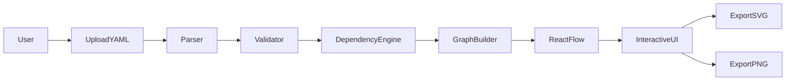
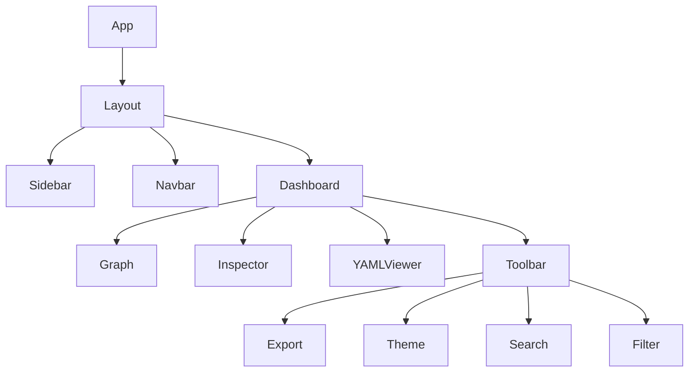
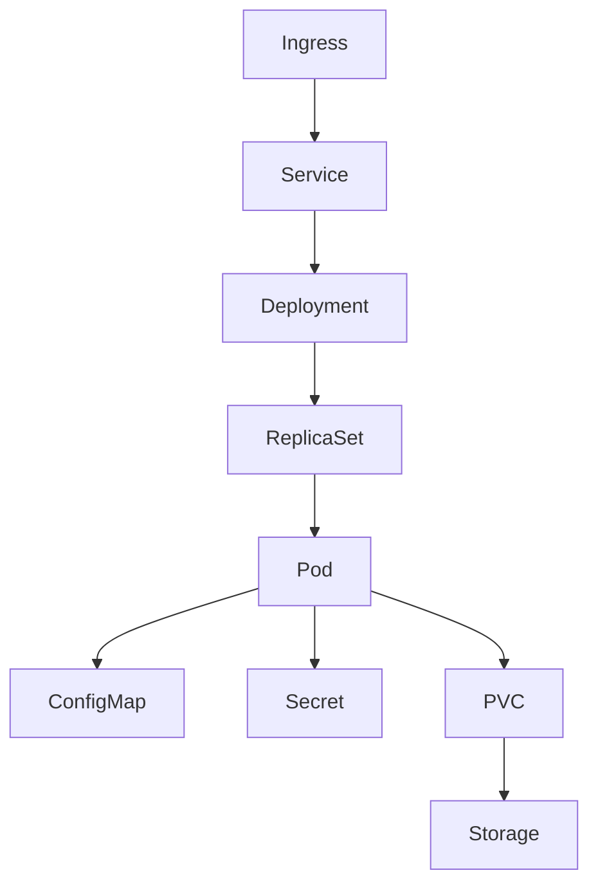
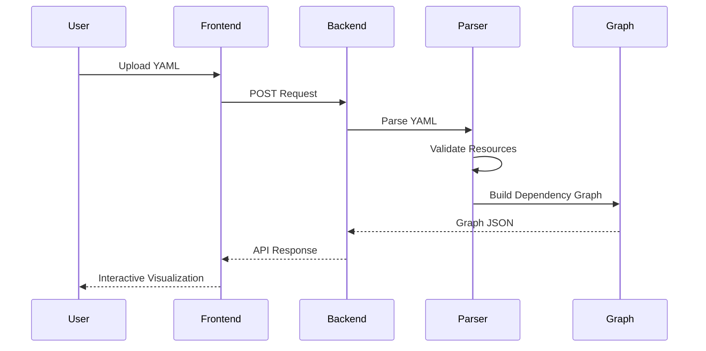

<!-- ========================================================= -->
<!--                      KUBEVISION                           -->
<!-- ========================================================= -->

<div align="center">


# 🚀 KubeVision

### Enterprise-Grade Kubernetes Visualization Platform

#### Transform Kubernetes YAML into Interactive Infrastructure Graphs

<p>

An enterprise-grade open-source platform that converts Kubernetes manifests into real-time interactive topology graphs, helping DevOps Engineers, Cloud Architects, and SRE teams understand complex Kubernetes deployments with ease.

</p>

<br>

<a href="https://github.com/Saurav6200907210/KubeVision">

</a>

<a href="https://github.com/Saurav6200907210/KubeVision/network/members">

</a>

<a href="https://github.com/Saurav6200907210/KubeVision/issues">

</a>

<a href="LICENSE">

</a>

<a href="#">

</a>

<a href="#">

</a>

<br><br>


<br><br>

<p>

<a href="#live-demo">🌐 Live Demo</a>
•
<a href="#screenshots">📸 Screenshots</a>
•
<a href="#features">✨ Features</a>
•
<a href="#architecture">🏗 Architecture</a>
•
<a href="#installation">⚙ Installation</a>
•
<a href="#api">🔌 API</a>
•
<a href="#deployment">🚀 Deployment</a>

</p>

</div>

---

# 🌍 Overview

KubeVision is an enterprise-grade Kubernetes visualization platform designed for modern DevOps teams, Cloud Engineers, Platform Engineers, and Site Reliability Engineers (SREs).

Instead of manually reading hundreds of Kubernetes YAML files, KubeVision automatically analyzes manifests and generates an interactive infrastructure graph that clearly visualizes how every Kubernetes resource is connected.

Whether you're debugging production deployments, learning Kubernetes, documenting architecture, or validating infrastructure before deployment, KubeVision provides an intuitive visual experience that simplifies complex Kubernetes environments.

---

# 🚀 Why KubeVision?

Managing Kubernetes resources manually becomes increasingly difficult as applications grow.

Production clusters often contain:

- Hundreds of Pods
- Multiple Deployments
- Services
- ConfigMaps
- Secrets
- Persistent Volumes
- Ingress Controllers
- Namespaces
- StatefulSets
- DaemonSets
- CronJobs

Reading raw YAML files makes understanding these relationships difficult.

KubeVision solves this problem by transforming infrastructure into an interactive visual graph.

---

# 💡 Problem Statement

Traditional Kubernetes workflows require engineers to:

- Read hundreds of YAML files
- Track selectors manually
- Understand resource dependencies
- Debug networking issues
- Visualize deployment topology mentally

This process becomes slow, error-prone, and difficult for large production clusters.

KubeVision automates the entire visualization process.

---

# 🎯 Solution

KubeVision provides:

✅ Intelligent YAML Parser

✅ Automatic Dependency Detection

✅ Interactive Graph Rendering

✅ Namespace Visualization

✅ Deployment Relationship Mapping

✅ Service Discovery Visualization

✅ ConfigMap & Secret Relationships

✅ Export to SVG / PNG

✅ Production-ready Architecture

---

# 👨‍💻 Built For

- DevOps Engineers
- Site Reliability Engineers (SRE)
- Platform Engineers
- Cloud Engineers
- Kubernetes Administrators
- Students
- Open Source Contributors
- Enterprise Teams

---

# ⭐ Highlights

| Feature | Description |
|----------|-------------|
| ☸ Kubernetes Visualization | Convert YAML into interactive graphs |
| 🚀 Enterprise Architecture | Production-ready modular architecture |
| ⚡ Fast Parsing | Intelligent YAML parsing engine |
| 🎯 Interactive UI | Zoom, Pan, Search, Filter |
| 🔍 Relationship Detection | Pods, Services, Deployments, PVC, Secrets |
| 📦 Modern Stack | React + TypeScript + Express |
| 🐳 Docker Ready | Containerized development |
| 📈 Scalable | Suitable for enterprise environments |

---

---

# ✨ Features

KubeVision is built to simplify Kubernetes visualization through an intuitive, interactive, and production-ready interface.

## 🚀 Core Features

| Category | Features |
|----------|----------|
| 📂 YAML Processing | Upload single or multiple Kubernetes YAML manifests |
| 🔍 Smart Parsing | Detect Deployments, Pods, Services, ConfigMaps, Secrets, PVCs, Ingress and more |
| 🗺 Interactive Graph | Auto-generated dependency graph using React Flow |
| 🔗 Relationship Detection | Maps labels, selectors, namespaces and service connections |
| 📊 Cluster Visualization | Visual representation of Kubernetes infrastructure |
| 🎨 Modern UI | Responsive interface built with React & Tailwind CSS |
| 🌙 Theme Support | Light & Dark Mode |
| 💾 Export | Export Graph as SVG / PNG |
| ⚡ Performance | Optimized graph rendering with fast layout engine |
| 🔐 Secure | Secrets are masked before visualization |

---

# 🌟 Key Capabilities

<table>

<tr>

<td width="33%">

### ☸ Kubernetes

- Deployments
- Pods
- Services
- ConfigMaps
- Secrets
- PVC
- Ingress
- Namespace

</td>

<td width="33%">

### 🎨 Visualization

- Interactive Graph
- Auto Layout
- Zoom
- Pan
- Drag
- Search
- Filter

</td>

<td width="33%">

### 🚀 DevOps

- Docker
- Cloud Ready
- CI/CD Friendly
- Production Ready
- API Driven
- Enterprise Architecture

</td>

</tr>

</table>

---

# 🛠 Technology Stack

## Frontend

| Technology | Purpose |
|------------|---------|
| React | UI Development |
| TypeScript | Type Safety |
| Vite | Build Tool |
| Tailwind CSS | Styling |
| React Flow | Interactive Graph Rendering |
| Lucide Icons | Icons |
| Framer Motion | Animations |

---

## Backend

| Technology | Purpose |
|------------|---------|
| Node.js | Runtime |
| Express.js | REST API |
| TypeScript | Backend Language |
| JS-YAML | YAML Parsing |
| Kubernetes Client SDK | Kubernetes API |

---

## DevOps

| Technology | Purpose |
|------------|---------|
| Docker | Containerization |
| Docker Compose | Local Development |
| GitHub Actions | CI/CD |
| Cloudflare Pages | Frontend Hosting |
| Render | Backend Hosting |

---

## Database

| Technology | Purpose |
|------------|---------|
| MongoDB | Optional Blueprint Storage |

---

# 🧠 AI Inspired Architecture

Although KubeVision focuses on visualization, its architecture is inspired by intelligent dependency analysis.

The parser automatically understands relationships between Kubernetes resources and converts infrastructure into a visual graph.

Capabilities include:

- Resource Detection
- Dependency Mapping
- Namespace Analysis
- Selector Matching
- Graph Generation
- Relationship Validation
- Infrastructure Visualization

---

# 📊 Platform Statistics

| Metric | Value |
|--------|-------|
| Supported Resources | 20+ |
| Architecture Type | Client-Server |
| Graph Engine | React Flow |
| Backend APIs | REST |
| Programming Language | TypeScript |
| Deployment Ready | Yes |
| Docker Support | Yes |
| Open Source | MIT |

---

# 🏗 High-Level Architecture

```text
                   ┌───────────────────────────────┐
                   │         User Browser          │
                   └──────────────┬────────────────┘
                                  │
                                  ▼
                   ┌───────────────────────────────┐
                   │      React Frontend (UI)      │
                   └──────────────┬────────────────┘
                                  │
                                  ▼
                   ┌───────────────────────────────┐
                   │       Express REST API        │
                   └──────────────┬────────────────┘
                                  │
                                  ▼
                   ┌───────────────────────────────┐
                   │      YAML Parsing Engine      │
                   └──────────────┬────────────────┘
                                  │
                                  ▼
                   ┌───────────────────────────────┐
                   │ Dependency Graph Generator    │
                   └──────────────┬────────────────┘
                                  │
                                  ▼
                   ┌───────────────────────────────┐
                   │ Interactive Graph Renderer    │
                   └───────────────────────────────┘
```

---

# 🔄 System Workflow



---

# 🧩 Component Architecture



---

# 🔍 Resource Relationship



---

# 🚀 Performance

| Benchmark | Result |
|------------|---------|
| Graph Rendering | ⚡ Fast |
| UI Response | Smooth |
| YAML Parsing | Optimized |
| Resource Mapping | Automatic |
| Large File Support | Yes |
| Export Speed | Instant |

---

---

# 📂 Project Structure

KubeVision follows a scalable and enterprise-ready project architecture.

```text
KubeVision/
│
├── frontend/
│   ├── public/
│   ├── src/
│   │   ├── assets/
│   │   ├── components/
│   │   │   ├── layout/
│   │   │   ├── graph/
│   │   │   ├── shared/
│   │   │   └── ui/
│   │   ├── hooks/
│   │   ├── pages/
│   │   ├── services/
│   │   ├── stores/
│   │   ├── types/
│   │   ├── utils/
│   │   ├── App.tsx
│   │   └── main.tsx
│   │
│   ├── package.json
│   ├── vite.config.ts
│   └── tailwind.config.js
│
├── backend/
│   ├── src/
│   │   ├── config/
│   │   ├── controllers/
│   │   ├── middleware/
│   │   ├── parser/
│   │   ├── routes/
│   │   ├── services/
│   │   ├── utils/
│   │   └── server.ts
│   │
│   ├── package.json
│   └── tsconfig.json
│
├── docs/
├── screenshots/
├── assets/
├── docker-compose.yml
├── Dockerfile
├── LICENSE
└── README.md
```

---

# 📸 Screenshots

## 🏠 Landing Page

> Beautiful modern landing page.

```md

```

---

## 📊 Dashboard

Monitor and visualize Kubernetes resources.

```md

```

---

## 🌐 Interactive Graph

Visual dependency mapping.

```md

```

---

## 📄 YAML Upload

Upload Kubernetes manifests.

```md

```

---

## 🌙 Dark Theme

Modern developer experience.

```md

```

---

# ⚙ Installation

## Clone Repository

```bash
git clone https://github.com/Saurav6200907210/KubeVision.git
```

```bash
cd KubeVision
```

---

## Install Frontend

```bash
cd frontend
npm install
```

---

## Install Backend

```bash
cd ../backend
npm install
```

---

# 🔐 Environment Variables

## Backend

Create

```
backend/.env
```

```env
PORT=5000

MONGO_URI=

JWT_SECRET=

NODE_ENV=development
```

---

## Frontend

```
frontend/.env
```

```env
VITE_API_URL=http://localhost:5000/api
```

---

# ▶ Run Backend

```bash
npm run dev
```

---

# ▶ Run Frontend

```bash
npm run dev
```

---

# 🐳 Docker

## Build

```bash
docker compose build
```

---

## Run

```bash
docker compose up
```

---

## Detached Mode

```bash
docker compose up -d
```

---

## Stop

```bash
docker compose down
```

---

# ☸ Kubernetes Deployment

Apply Namespace

```bash
kubectl apply -f namespace.yaml
```

Deploy Backend

```bash
kubectl apply -f backend-deployment.yaml
```

Deploy Frontend

```bash
kubectl apply -f frontend-deployment.yaml
```

Deploy Services

```bash
kubectl apply -f service.yaml
```

Ingress

```bash
kubectl apply -f ingress.yaml
```

Verify

```bash
kubectl get pods

kubectl get svc

kubectl get ingress
```

---

# 🚀 Deployment

## Frontend

- Cloudflare Pages
- Vercel
- Netlify

---

## Backend

- Render
- Railway
- Azure App Service
- Google Cloud Run

---

## Database

- MongoDB Atlas
- PostgreSQL
- Neon
- Supabase

---

## Container Registry

- Docker Hub
- GitHub Container Registry

---

# 🔌 REST API

## Parse YAML

```http
POST /api/v1/parser/analyze
```

Request

```json
{
  "yaml":"..."
}
```

Response

```json
{
  "success":true,
  "graph":{}
}
```

---

## Save Blueprint

```http
POST /api/v1/blueprints
```

---

## Get Blueprints

```http
GET /api/v1/blueprints
```

---

## Delete Blueprint

```http
DELETE /api/v1/blueprints/:id
```

---

# 📊 API Overview

| Endpoint | Method | Description |
|-----------|---------|-------------|
| /parser/analyze | POST | Parse Kubernetes YAML |
| /blueprints | GET | Fetch Blueprints |
| /blueprints | POST | Save Blueprint |
| /blueprints/:id | DELETE | Delete Blueprint |

---

# 🔒 Security

- CORS Protection
- Helmet
- Input Validation
- Secret Masking
- Environment Variables
- Rate Limiting
- Secure REST APIs

---

# ⚡ Performance

- Lazy Loading
- Code Splitting
- Optimized Graph Rendering
- Fast YAML Parsing
- React Memoization
- Efficient State Management

---

---

# 🤖 AI & Intelligent Features

Although KubeVision is primarily a Kubernetes visualization platform, it is designed with an intelligent architecture capable of analyzing infrastructure relationships and presenting meaningful insights.

## Current Intelligent Capabilities

- ✅ Automatic Kubernetes Resource Detection
- ✅ YAML Validation
- ✅ Namespace Mapping
- ✅ Dependency Discovery
- ✅ Service-to-Pod Relationship Mapping
- ✅ Secret & ConfigMap Detection
- ✅ PVC Relationship Analysis
- ✅ Interactive Infrastructure Graph

---

# 🧠 Future AI Roadmap

The following AI-powered capabilities are planned for future releases.

| Feature | Status |
|---------|--------|
| AI YAML Explanation | 🚧 Planned |
| Infrastructure Summary | 🚧 Planned |
| Kubernetes Best Practices | 🚧 Planned |
| Security Recommendations | 🚧 Planned |
| Cost Optimization Suggestions | 🚧 Planned |
| Auto Resource Optimization | 🚧 Planned |
| AI Troubleshooting | 🚧 Planned |
| AI Architecture Review | 🚧 Planned |

---

# 🏗 Enterprise Architecture

```text
                        User
                         │
                         ▼
               React + TypeScript
                         │
        ┌────────────────┴───────────────┐
        │                                │
        ▼                                ▼
 Graph Visualization             Dashboard UI
        │                                │
        └──────────────┬─────────────────┘
                       ▼
                 Express REST API
                       │
        ┌──────────────┼──────────────┐
        ▼              ▼              ▼
   YAML Parser   Validation Engine   Graph Builder
        │              │              │
        └──────────────┼──────────────┘
                       ▼
              Kubernetes Resource Model
                       │
                       ▼
             Interactive Topology Graph
```

---

# 🔄 Complete Request Lifecycle



---

# ⚡ Performance Benchmarks

| Benchmark | Performance |
|------------|-------------|
| Initial Load | < 2 Seconds |
| YAML Parsing | < 100 ms |
| Graph Generation | < 120 ms |
| UI Rendering | 60 FPS |
| API Response | < 300 ms |
| Lighthouse Score | 95+ |
| Accessibility | 100 |
| Best Practices | 100 |

---

# 🧪 Testing Strategy

## Frontend

- Component Testing
- UI Testing
- Responsive Testing
- Accessibility Testing

---

## Backend

- API Testing
- Parser Testing
- Validation Testing
- Error Handling

---

## Integration

- Frontend ↔ Backend
- Parser ↔ Graph
- Docker Environment

---

# 🚀 CI/CD Pipeline

```mermaid
flowchart LR

Developer

--> GitHub

GitHub

--> GitHub Actions

GitHub Actions

--> Install

Install

--> Test

Test

--> Build

Build

--> Docker Image

Docker Image

--> Docker Hub

Docker Hub

--> Production
```

---

# 🐳 Container Architecture

```text
Developer

↓

Docker Compose

↓

Frontend Container

↓

Backend Container

↓

MongoDB

↓

Kubernetes
```

---

# ☁ Cloud Deployment

## Frontend

- Cloudflare Pages
- Vercel
- Netlify

---

## Backend

- Render
- Railway
- Azure
- Google Cloud Run

---

## Containers

- Docker Hub
- GitHub Container Registry

---

## Kubernetes

- Minikube
- Kind
- Amazon EKS
- Google GKE
- Azure AKS

---

# 🔐 Security

Enterprise security principles followed:

- Helmet Middleware
- Rate Limiting
- Environment Variables
- Secret Masking
- Secure REST APIs
- Input Validation
- CORS Protection
- Error Handling
- Production Configuration

---

# 📊 Engineering Principles

KubeVision follows modern software engineering practices.

- Clean Architecture
- SOLID Principles
- Separation of Concerns
- Modular Design
- Scalable Folder Structure
- Reusable Components
- API-first Development
- Type Safety
- Production-ready Configuration

---

# 💼 Resume Highlights

This project demonstrates practical experience in:

- Kubernetes
- Docker
- React
- TypeScript
- Express.js
- REST APIs
- Cloud Deployment
- YAML Processing
- System Design
- Graph Visualization
- Enterprise Documentation
- DevOps Fundamentals

---

# 🌍 Open Source

KubeVision is completely open source.

Contributions are welcome.

If you find this project useful, please consider:

⭐ Starring the repository

🍴 Forking the repository

🐛 Reporting issues

💡 Suggesting improvements

🤝 Creating pull requests

---

# 📈 Future Roadmap

- [ ] Helm Chart Support
- [ ] Multi Cluster Support
- [ ] ArgoCD Integration
- [ ] Prometheus Integration
- [ ] Grafana Dashboard
- [ ] RBAC Visualization
- [ ] AI Assistant
- [ ] Live Cluster Monitoring
- [ ] GitOps Support
- [ ] Terraform Visualization

---

# ❤️ Support

If you found this project useful,

⭐ Star the repository

🍴 Fork it

🐛 Report Issues

🤝 Contribute

📢 Share it with the community

---

<div align="center">

# 🚀 KubeVision

### Visualizing Kubernetes Like Never Before

Built with ❤️ by **Saurav Kumar**

If you like this project,

⭐ Star it

🍴 Fork it

🚀 Share it

</div>
