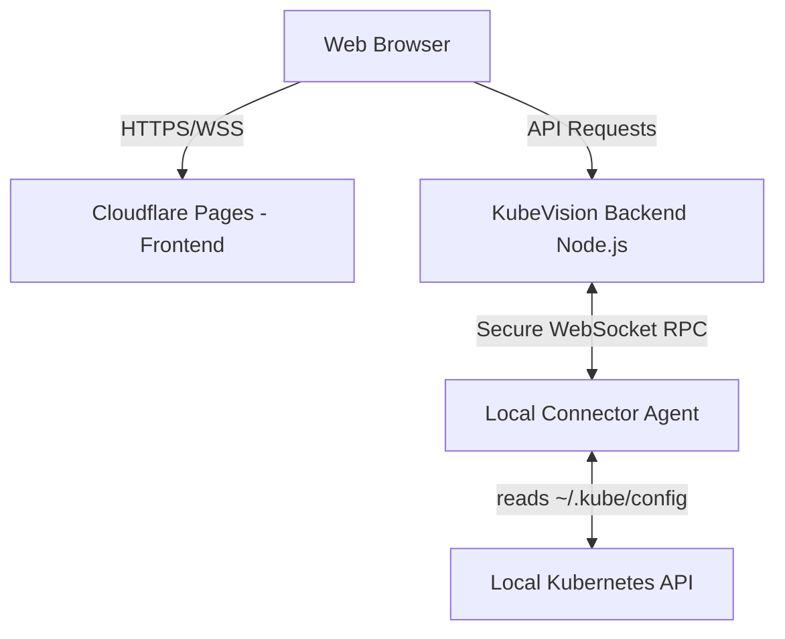
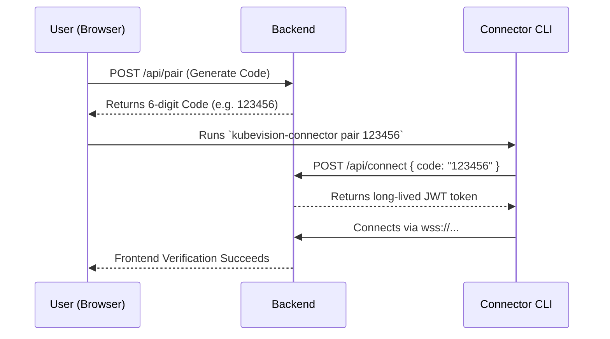

# KubeVision Local Connector

The KubeVision Local Connector is a lightweight, cross-platform Node.js agent that bridges your local Kubernetes clusters (Minikube, Kind, Docker Desktop, k3d, etc.) to the KubeVision dashboard.

## Architecture



## Sequence Diagram (Pairing Flow)



## Installation Guide

### Via NPM
```bash
npm install -g kubevision-connector
```

### Via Binaries
Download the latest binaries for your platform (Windows MSI, macOS PKG, Linux AppImage) from the [Releases](#) page.

## Developer Guide

### Prerequisites
- Node.js 20+

### Setup
```bash
git clone <repo>
cd kubevision/connector
npm install
```

### Running Locally
```bash
npm run dev
```

### Testing the Pairing Flow Locally
1. Start the backend (`npm run dev` in `/backend`).
2. Start the frontend (`npm run dev` in `/frontend`) and click "Generate Pairing Code".
3. Pair the connector locally: `npm run dev -- pair <CODE>`
4. Start the connector: `npm run dev -- start`
